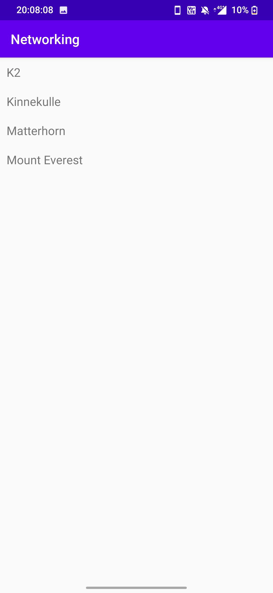

Den här uppgiften gick ut på att skapa en recyclerview med en adapter och sen med recyclerviewen hämta data från en web service via JSON-objekt. 
Klassen Mountain skapades för att kunna matcha objetet, sedan användes GSON för att parsa datan. 
Layoutfilerna innehåller en recyclerview och activity_mountains.xml som är varje rad i recyclerviewen med en textview.

RecyclerViewAdapter:

```
public class RecyclerViewAdapter extends RecyclerView.Adapter<RecyclerViewAdapter.ViewHolder> {

    private List<Mountain> listOfMountains;
    private LayoutInflater layoutInflater;
    private OnClickListener onClickListener;

    RecyclerViewAdapter(Context context, List<Mountain> items, OnClickListener onClickListener) {
        this.layoutInflater = LayoutInflater.from(context);
        this.listOfMountains = items;
        this.onClickListener = onClickListener;
    }

    @Override
    @NonNull
    public ViewHolder onCreateViewHolder(@NonNull ViewGroup parent, int viewType) {
        return new ViewHolder(layoutInflater.inflate(R.layout.activity_mountains, parent, false));
    }

    @Override
    public void onBindViewHolder(ViewHolder holder, int position) {
        holder.title.setText(listOfMountains.get(position).toString());
    }

    @Override
    public int getItemCount() {
        return listOfMountains.size();
    }

    public class ViewHolder extends RecyclerView.ViewHolder implements View.OnClickListener {
        TextView title;

        ViewHolder(View itemView) {
            super(itemView);
            itemView.setOnClickListener(this);
            title = itemView.findViewById(R.id.title);
        }

        @Override
        public void onClick(View view) {
            onClickListener.onClick(listOfMountains.get(getAdapterPosition()));
        }
    }

    public interface OnClickListener {
        void onClick(Mountain item);
    }
}
```

```
public class Mountain {

    private String name;
    private String location;
    private int height;

    public String getName() {
        return name;
    }

    public Mountain(){
        name="Missing name";
        location="missing location";
        height=0;
    }

    public Mountain(String n, String l, int h){
        name = n;
        location=l;
        height=h;
    }

    public String info(){
        String tmp= new String();
        tmp+=name+" is located in " + location + " is " + height + "meters above sea level.";
        return tmp;
    }

    public String toString(){
        return name;
    }
}
```

Bild på appen med berg.

